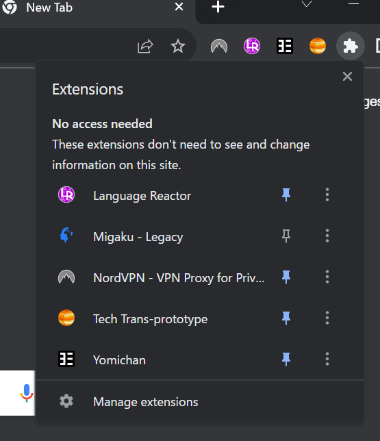
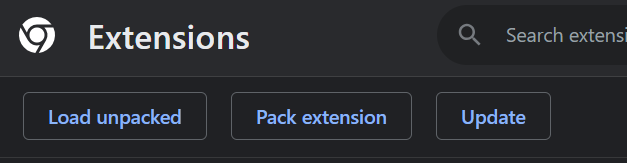

# 開発環境の初期化

## npmからパッケージをインストールします

```bash
npm i
```

## ビルドします

```bash
npm run build
```

## Chromeで拡張機能のウィンドウへ移動します

「Manage Extensions」を選択します



## Chromeで「build」のフォルダーを拡張機能として追加しましょう

「Load unpacked extension」を選択します



# 開発環境の使い方

自動的に変化がChromeに反映されます

```bash
npm run watch
```

# プロジェクト構造の説明

## src/

### background.js

### contentScript.js

Chromeのタブごとに<script>として入れられます。

### components/

### popup.js && popup.css
右上にあるポップアップのJavaScriptとCSSです。

## public/

すべてのファイルとフォルダーがビルドされたときにすべての中身がそのままコピーされます。
